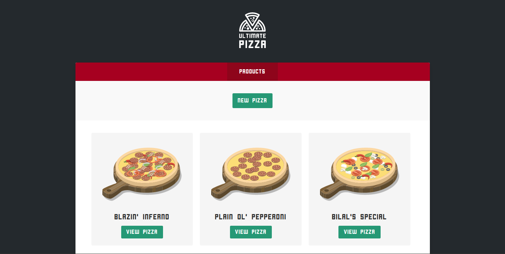
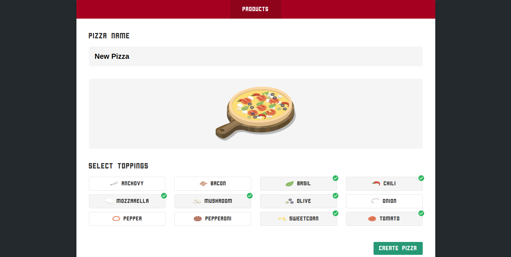

# NgRx-Store-Pizza-App

This is Angular app with NgRx store, Effects and Router Store implemented. It provides functionality of creating, updating, viewing and deleting pizzas, everything driven from the NgRx Store. In the future it could be extended to a full pizza store.

Screenshot 1:

Screenshot 2:

